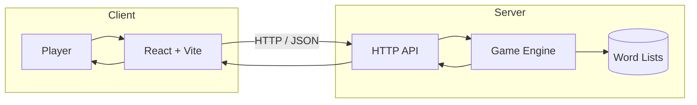

# Quintle — Daily challenge. Unlimited practice. 

Quintle is a browser-based word puzzle game where players have six attempts to guess a hidden five-letter word. 
<br>It features both a daily challenge and an unlimited practice mode, with color-coded feedback after every guess.

Built as part of a Chingu Voyage, the project combines a React frontend with a Go backend responsible for game logic, guess validation, session management, and a REST API.

## Architecture

The frontend communicates with a stateless HTTP API.Player progress is associated with a browser session, while the backend manages game state, validates guesses, and returns structured JSON responses.



## Features

- 🟩 Daily challenge with a new puzzle every day
- ♾️ Unlimited practice mode
- 🎯 Color-coded feedback following Wordle-style rules
- 🍪 Session persistence across page refreshes
- ⌨️ Full keyboard support
- 📱 Responsive interface for desktop and mobile
- ⚡ REST API for gameplay and validation

## API Endpoints

| Method | Endpoint | Description |
|---------|----------|-------------|
| GET | /api/daily-word | Retrieve the current daily game |
| POST | /api/guess | Submit a guess for the daily challenge |
| POST | /api/practice/new-game | Start a new practice game |
| POST | /api/practice/guess | Submit a practice guess |

## Tech Stack

**Frontend**

- React
- Vite
- Tailwind CSS

**Backend**

- Go
- net/http
- JSON REST API
- Cookie-based session management

**Testing**

- Go testing package
- NVDA screen reader for accessibility

## Project Structure

```text
.
├── backend/
│   ├── cmd/          Application entry point
│   ├── internal/     API handlers and game logic
│   └── words/        Answer and dictionary lists
└── frontend/
    ├── src/
    └── public/
```

## Getting Started

### Prerequisites

- Node.js 20+
- Go 1.25+
- npm

### Frontend

```bash
cd frontend
npm install
npm run dev
```

### Backend

From the project root:

```bash
go run ./backend/cmd/server
```

The backend runs on port `8080` by default.

## Running Tests

From the project root:

```bash
go test ./...
```

## Contributors

| Member | Role | Links |
|--------|------|-------|
| **Camille Onoda** | Backend Developer | [GitHub](https://github.com/CamilleOnoda) • [LinkedIn](https://linkedin.com/in/camilleonoda) |
| **Yusuf Mohsen** | UI/UX Designer | [GitHub](https://github.com/yusufmohsiin) • [LinkedIn](https://www.linkedin.com/in/yusuf-mohsiin) |
| **Nazeeha Bhoira** | Frontend Developer | [GitHub](https://github.com/nazeeha-kb) • [LinkedIn](https://linkedin.com/in/nazeeha-kb) |

## Acknowledgements

This project was created by Team 35 during Chingu Voyage 61 as a collaborative full-stack development project.
