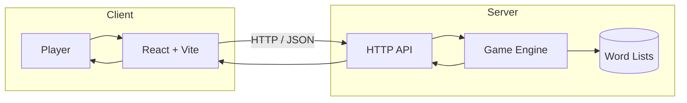

# Letter Leap

Letter Leap is a browser-based word puzzle game where players have six attempts to guess a hidden five-letter word. It features both a daily challenge and an unlimited practice mode, with color-coded feedback after every guess.

Built as part of a Chingu Voyage, the project combines a React frontend with a Go backend that handles game logic, validation, and API responses.



## Features

- 🟩 Daily challenge with a new word every day
- ♾️ Unlimited practice mode
- 🎯 Color-coded feedback for each guess
- ⌨️ Full keyboard support
- 📱 Responsive interface for desktop and mobile
- ⚡ REST API powering gameplay and validation

## Tech Stack

**Frontend**

- React
- Vite
- Tailwind CSS

**Backend**

- Go
- `net/http`
- JSON REST API

**Testing**

- Go testing package

## Project Structure

```text
.
├── backend/    Go server, game logic, and API handlers
└── frontend/   React application and UI components
```

## Getting Started

### Prerequisites

- Node.js 20+
- Go 1.25+
- npm

### Frontend

```bash
cd frontend
npm install
npm run dev
```

### Backend

From the project root:

```bash
go run ./backend/cmd/server
```

The backend runs on port `8080` by default.

## Running Tests

From the project root:

```bash
go test ./...
```

## Team

- Camille Onoda: [GitHub](https://github.com/CamilleOnoda) / [LinkedIn](https://linkedin.com/in/camilleonoda)
- Dara Offiong: [GitHub](https://github.com/sladethedragonslayer) / [LinkedIn](https://www.linkedin.com/in/offiong-dara)
- Yusuf Mohsen: [GitHub](https://github.com/yusufmohsiin) / [LinkedIn](https://www.linkedin.com/in/yusuf-mohsiin)
- Nazeeha Bhoira: [GitHub](https://github.com/nazeeha-kb) / [LinkedIn](https://linkedin.com/in/nazeeha-kb)

## Acknowledgements

This project was created by Team 35 during Chingu Voyage 61 as a collaborative full-stack development project.